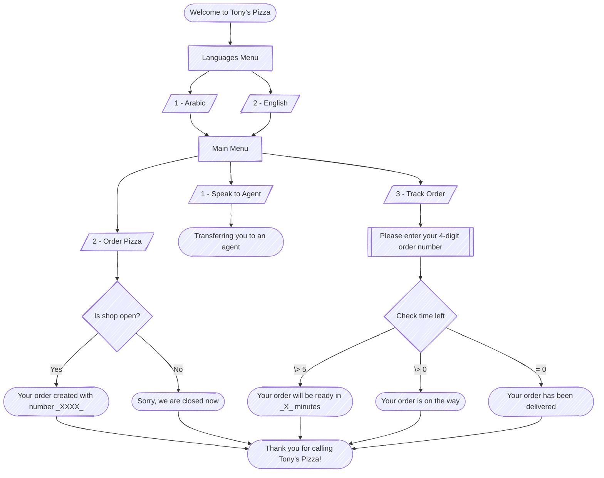

# Project 0: Pizza Shop IVR

## Diagram

## Prompt Matrix

| Filename                | English Prompt                                                                        | Arabic Prompt                                                                     |
| ----------------------- | ------------------------------------------------------------------------------------- | --------------------------------------------------------------------------------- |
| Welcome.wav             | Welcome to Tony’s Pizza.                                                              | أهلاً بك في بيتزا توني.                                                           |
| LangMenu.wav            | For English press 2                                                                   | للغة العربية اضغط 1                                                               |
| MainMenu.wav            | To Speak to an agent, press 1. To Order pizza, press 2. To Track your order, press 3. | للتحدث مع أحد موظفي خدمة العملاء، اضغط 1. لطلب بيتزا، اضغط 2. لتتبع طلبك، اضغط 3. |
| NoInput.wav             | Sorry, we did not receive any input.                                                  | عذراً، لم نستلم أي إدخال.                                                         |
| NoMatch.wav             | Sorry, that is not a valid option.                                                    | عذراً، هذا خيار غير صحيح.                                                         |
| MaxTries.wav            | Sorry, you have exceeded the maximum number of attempts.                              | عذراً، لقد تجاوزت الحد الأقصى لعدد المحاولات.                                     |
| TransferringToAgent.wav | Transferring you to an agent, please hold.                                            | جارٍ تحويلك إلى أحد موظفين خدمة العملاء، يرجى الانتظار.                           |
| OrderOnTheWay.wav       | Your order is on the way.                                                             | طلبك في الطريق.                                                                   |
| ShopClosed.wav          | Sorry, we are closed now.                                                             | نأسف، نحن مغلقون حالياً.                                                          |
| EnterOrderNumber.wav    | Please enter your 4-digit order number.                                               | يرجى إدخال رقم طلبك المكون من 4 أرقام.                                            |
| OrderCreated.wav        | Your order has been created with number                                               | تم إنشاء طلبك بالرقم                                                              |
| WillBeReadyIn.wav       | It will be ready in                                                                   | سيكون جاهزاً خلال                                                                 |
| Minutes.wav             | minutes                                                                               | دقائق                                                                             |
| OrderDelivered.wav      | Your order has been delivered.                                                        | تم توصيل طلبك.                                                                    |
| ThankYou.wav            | Thank you for calling Tony’s Pizza!                                                   | شكراً لاتصالك ببيتزا توني!                                                        |
