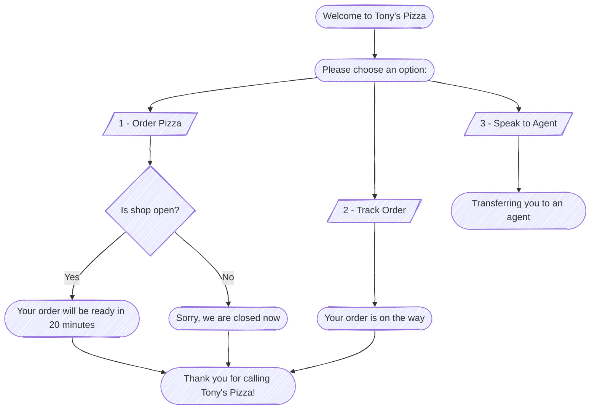

# Project 0: Pizza Shop IVR

## Diagram

## Prompt Matrix

| Filename                | English Prompt                                                            | Arabic Prompt                                                       |
| ----------------------- | ------------------------------------------------------------------------- | ------------------------------------------------------------------- |
| Welcome.wav             | Welcome to Tony’s Pizza.                                                  | أهلاً بك في بيتزا توني.                                             |
| MainMenu.wav            | Order pizza, press 1. Track your order, press 2. Speak to staff, press 3. | لطلب بيتزا، اضغط 1. لتتبع طلبك، اضغط 2. للتحدث مع الموظفين، اضغط 3. |
| NoInput.wav             | Sorry, we did not receive any input.                                      | عذراً، لم نستلم أي إدخال.                                           |
| NoMatch.wav             | Sorry, that is not a valid option.                                        | عذراً، هذا خيار غير صحيح.                                           |
| OrderConfirmed.wav      | Your order will be ready in 20 minutes.                                   | طلبك سيكون جاهزاً خلال 20 دقيقة.                                    |
| ShopClosed.wav          | Sorry, we are closed now.                                                 | نأسف، نحن مغلقون حالياً.                                            |
| OrderOnTheWay.wav       | Your order is on the way.                                                 | طلبك في الطريق.                                                     |
| TransferringToAgent.wav | Transferring you to an agent, please hold.                                | جارٍ تحويلك إلى أحد موظفين خدمة العملاء، يرجى الانتظار.             |
| ThankYou.wav            | Thank you for calling Tony’s Pizza!                                       | شكراً لاتصالك ببيتزا توني!                                          |
