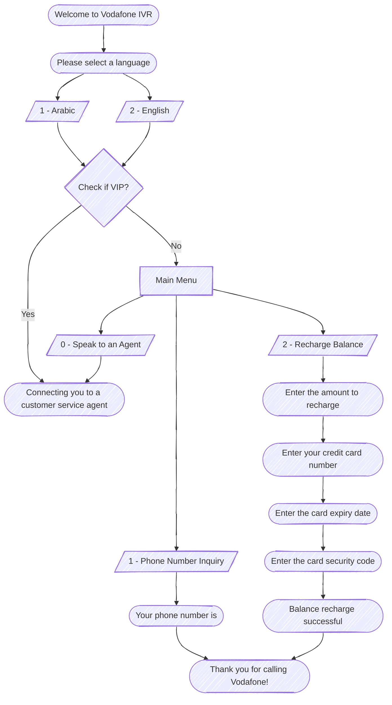

# Project 1: Telecom IVR

## Diagram

## Prompt Matrix

| Filename             | English Prompt                                                                                                           | Arabic Prompt                                                                                           |
| -------------------- | ------------------------------------------------------------------------------------------------------------------------ | ------------------------------------------------------------------------------------------------------- |
| Welcome.wav          | Welcome to Vodafone IVR                                                                                                  | مرحباً بكم في فودافون                                                                                   |
| LangMenu.wav         | For Arabic press 1, for English press 2                                                                                  | للغة العربية اضغط 1، للغة الإنجليزية اضغط 2                                                             |
| MainMenu.wav         | For phone number inquiry press 1, for balance recharge press 2, for other services press 3, to speak to an agent press 0 | للاستعلام عن رقم الهاتف اضغط 1، لشحن الرصيد اضغط 2، للخدمات أخرى اضغط 3، للتحدث إلى خدمة العملاء اضغط 0 |
| PhoneNumber.wav      | Your phone number is                                                                                                     | رقم هاتفك هو                                                                                            |
| RechargeAmount.wav   | Enter the amount to recharge                                                                                             | أدخل المبلغ المطلوب شحنه                                                                                |
| CreditCardNumber.wav | Enter your credit card number                                                                                            | أدخل رقم بطاقة الائتمان                                                                                 |
| ExpiryDate.wav       | Enter the card expiry date                                                                                               | أدخل تاريخ انتهاء البطاقة                                                                               |
| SecurityCode.wav     | Enter the card security code                                                                                             | أدخل رمز أمان البطاقة                                                                                   |
| RechargeSuccess.wav  | Balance recharge successful                                                                                              | تم شحن الرصيد بنجاح                                                                                     |
| Agent.wav            | Connecting you to a customer service agent                                                                               | جاري تحويلك إلى أحد ممثلي خدمة العملاء                                                                  |
| ThankYou.wav         | Thank you for calling Vodafone                                                                                           | شكراً لاتصالك بفودافون                                                                                  |
