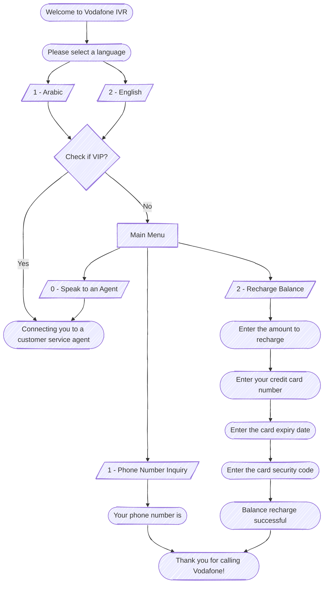

# Project 1: Telecom IVR

## Diagram

## Prompt Matrix

| Filename             | English Prompt                                                                                                           | Arabic Prompt                                                                                           |
| -------------------- | ------------------------------------------------------------------------------------------------------------------------ | ------------------------------------------------------------------------------------------------------- |
| Welcome.wav          | Welcome to Vodafone IVR                                                                                                  | مرحباً بكم في فودافون                                                                                   |
| LangMenu.wav         | For Arabic press 1, for English press 2                                                                                  | للغة العربية اضغط 1، للغة الإنجليزية اضغط 2                                                             |
| MainMenu.wav         | For phone number inquiry press 1, for balance recharge press 2, for other services press 3, to speak to an agent press 0 | للاستعلام عن رقم الهاتف اضغط 1، لشحن الرصيد اضغط 2، للخدمات أخرى اضغط 3، للتحدث إلى خدمة العملاء اضغط 0 |
| PhoneNumber.wav      | Your phone number is                                                                                                     | رقم هاتفك هو                                                                                            |
| RechargeAmount.wav   | Enter the amount to recharge                                                                                             | أدخل المبلغ المطلوب شحنه                                                                                |
| CreditCardNumber.wav | Enter your credit card number                                                                                            | أدخل رقم بطاقة الائتمان                                                                                 |
| ExpiryDate.wav       | Enter the card expiry date                                                                                               | أدخل تاريخ انتهاء البطاقة                                                                               |
| SecurityCode.wav     | Enter the card security code                                                                                             | أدخل رمز أمان البطاقة                                                                                   |
| RechargeSuccess.wav  | Balance recharge successful                                                                                              | تم شحن الرصيد بنجاح                                                                                     |
| Agent.wav            | Connecting you to a customer service agent                                                                               | جاري تحويلك إلى أحد ممثلي خدمة العملاء                                                                  |
| ThankYou.wav         | Thank you for calling Vodafone                                                                                           | شكراً لاتصالك بفودافون                                                                                  |

## Task

### Task Diagram

### Task Prompt Matrix

| Filename                   | English Prompt                                                                                                                 | Arabic Prompt                                                                                           |
| -------------------------- | ------------------------------------------------------------------------------------------------------------------------------ | ------------------------------------------------------------------------------------------------------- |
| Welcome.wav                | Welcome to Vodafone IVR                                                                                                        | مرحباً بكم في فودافون                                                                                   |
| LangMenu.wav               | For Arabic press 1, for English press 2                                                                                        | للغة العربية اضغط 1، للغة الإنجليزية اضغط 2                                                             |
| MainMenu.wav               | For phone number inquiry press 1, for balance recharge press 2, for other services press 3, to speak to an agent press 0       | للاستعلام عن رقم الهاتف اضغط 1، لشحن الرصيد اضغط 2، للخدمات أخرى اضغط 3، للتحدث إلى خدمة العملاء اضغط 0 |
| PhoneNumber.wav            | Your phone number is                                                                                                           | رقم هاتفك هو                                                                                            |
| RechargeAmount.wav         | Enter the amount to recharge                                                                                                   | أدخل المبلغ المطلوب شحنه                                                                                |
| CreditCardNumber.wav       | Enter your credit card number                                                                                                  | أدخل رقم بطاقة الائتمان                                                                                 |
| ExpiryDate.wav             | Enter the card expiry date                                                                                                     | أدخل تاريخ انتهاء البطاقة                                                                               |
| SecurityCode.wav           | Enter the card security code                                                                                                   | أدخل رمز أمان البطاقة                                                                                   |
| RechargeSuccess.wav        | Balance recharge successful                                                                                                    | تم شحن الرصيد بنجاح                                                                                     |
| OtherServices.wav          | For balance transfer press 1, for internet packages press 2, for call tone services press 3, for promotions and offers press 4 | لتحويل الرصيد اضغط 1، لباقات الإنترنت اضغط 2، لخدمات الكول تون اضغط 3، للعروض والخصومات اضغط 4          |
| BalanceTransferNumber.wav  | Enter the number to transfer balance to                                                                                        | أدخل الرقم المطلوب تحويل الرصيد إليه                                                                    |
| BalanceTransferAmount.wav  | Enter amount to transfer                                                                                                       | أدخل المبلغ المطلوب تحويله                                                                              |
| BalanceTransferSuccess.wav | Balance transferred successfully                                                                                               | تم تحويل الرصيد بنجاح                                                                                   |
| InternetPackagesSMS.wav    | Internet packages have been sent via SMS                                                                                       | تم إرسال باقات الإنترنت عبر الرسائل القصيرة                                                             |
| CallToneSMS.wav            | Call tone options have been sent via SMS                                                                                       | تم إرسال خيارات الكول تون عبر الرسائل القصيرة                                                           |
| PromotionsSMS.wav          | Latest offers have been sent via SMS                                                                                           | تم إرسال أحدث العروض عبر الرسائل القصيرة                                                                |
| Agent.wav                  | Connecting you to a customer service agent                                                                                     | جاري تحويلك إلى أحد ممثلي خدمة العملاء                                                                  |
| ThankYou.wav               | Thank you for calling Vodafone                                                                                                 | شكراً لاتصالك بفودافون                                                                                  |
